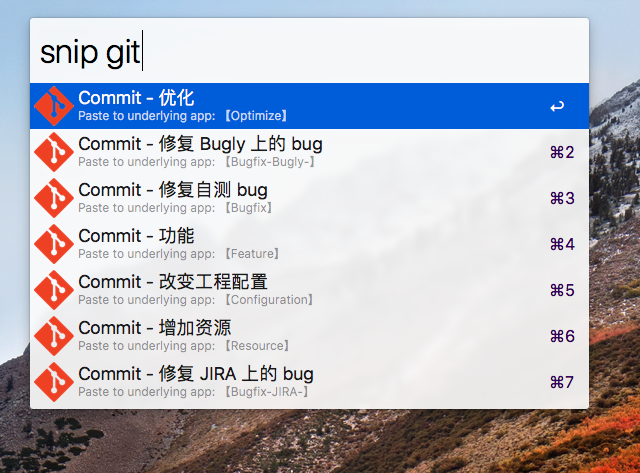

# Git Flow

## 分支类型

* master
* dev
* feature
* hotfix
* preproduct

### master

线上代码分支。

【创建】在创建 repo 的时候创建 `master` 分支。

【命名】master

【描述】所有 release 的 tag 都打在 `master`，并且 `master` 不能直接 commit，只能通过 merge 来完成代码提交。

【输入】合并自 `preproduct` `hotfix`

【输出】`hotfix`

【销毁】master 分支是恒定存在的

### dev

稳定开发分支

【创建】在创建 `master` 分支时，立即创建 `dev` 分支

【命名】dev

【描述】新版本需求来的时候管理员会从 `dev` 中拉出一条版本分支。`dev` 分支里保存完整的版本迭代和测试环境下已经修复的 bug。

【输入】合并自 `feature` `hotfix ` `preproduct`

【输出】版本 release 时并入 `master`

【销毁】dev 分支是恒定存在的

### feature / version

功能分支、新版本分支

【创建】当有新版本计划时，从 `dev` 中拉取

【命名】dev_1.0.0

【描述】存放某个版本的集成代码，包括这个版本在内测环境下的 bug 修复代码

【输入】开发人员 commit

【输出】版本结束后并入 `dev`

【销毁】并入后销毁

### preproduct

某版本预生产分支

【创建】当某个版本的测试环境通过后，从 feature 分支并入 dev 分支时，从 dev 分支拉取出的分支

【命名】pre_1.0.0

【描述】存放某个版本的预生产代码，修复预生产时候的 bug

【输入】从 `dev` 中拉取，开发人员 commit

【输出】版本结束后同时并入 `master` 和 `dev`（不是并入 `dev` 再从 `dev` 并入 `master`）

【销毁】并入后销毁

### hotfix

热补丁分支

【创建】从 `master` 拉取。

【命名】hotfix/新版本号

【描述】需要紧急上线一个补丁版本，且已有新版本的 `feature` 分支时，需要创建该分支。如果当前没有新版本的 `feature` 分支，则按正常开发逻辑走流程。

【输入】开发人员 commit

【输出】先并入 `master`；判断 `preproduct` 是否存在 ？ 并入 `preproduct` : 并入 `dev`

【销毁】并入后销毁

## 提交格式

使用 SourceTree 完成 commit，message 可以换行。

大致格式如下：

```
【信息分类】简略描述
详细描述
【URL】bugly 地址，或者 JIRA 地址
```

### 信息分类

#### Bugfix

【修复】修复自己开发过程中自测出来的问题

【修复-jira-{id}】修复 jira 上的问题，附带 bug id

【修复-bugly-{id}】修复 bugly 上的问题，附带 bug id

### Feature

【新增】增加新的功能

### Optmize

【优化】优化某些代码

### Resource

【资源】资源文件的修改，不涉及代码

### Configuration

【配置】修改版本号，修改打包脚本，修改工程配置，不涉及代码

### PS

增加文件会更改到工程文件，此部分更改属于 Feature 的内容。

### 举例

增加某个功能：

```
【新增】购物车一键清空功能
批量删除购物车内的商品。
```

修复了某个自测 bug

```
【修复】清空购物车的时跳出支付页面
清空购物车的时候并没有删除商品，而是全选并支付。
```

修复了某个内测 bug

```
【修复-jira-10019】清空购物车按钮点击无效果
selector 编辑错误，导致 controller 没有响应事件。
【URL】http://jira.luckincoffee.com/products/luckincoffee/id_xxxxxx.html
```

修复了某个线上 bug

```
【修复-bugly-1191】WebView 闪退
对 WebView 中的编辑框操作（复制、全选、粘贴）时会闪退。
【URL】http://bugly.qq.com/luckincoffee/id_xxxxxx.html
```

## 时序图


## GitFlow.alfredsnippets 使用

电脑安装 Alfred 3

双击 *GitFlow.alfredsnippets* 文件，导入到 Alfred 中

> GitFlow.alfredsnippets 文件在此 repo 的 /page/iOS-Git-Flow 文件夹下可以找到

光标选中 SourceTree 的 commit 信息编辑框


激活 Alfred 窗口（ 默认快捷键是 `Option` + `Space` ），输入 `snip git` 即可出现 commit 模板。



选中想要提交的内容，按 `cmd + 数字` 即可。